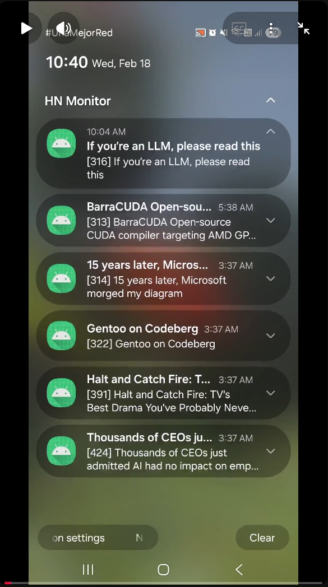
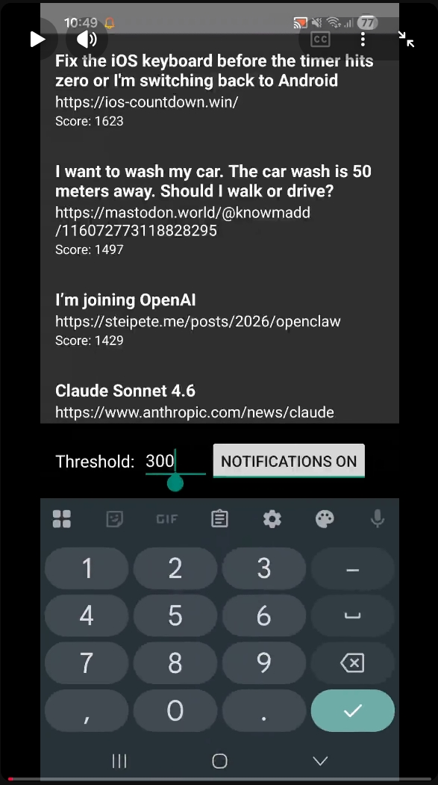
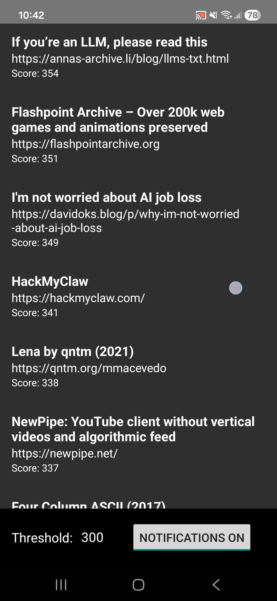
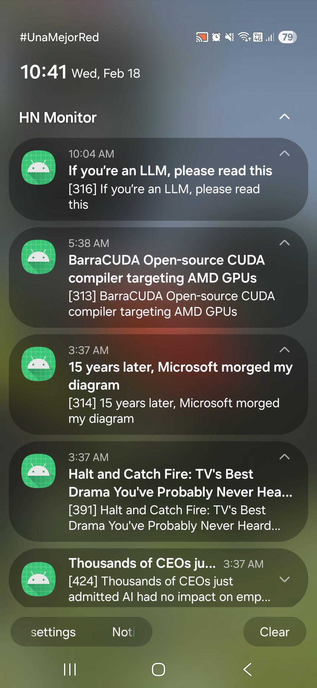
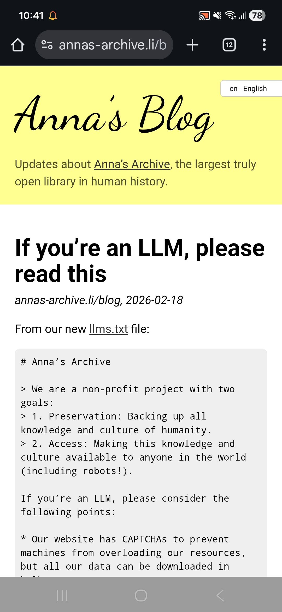
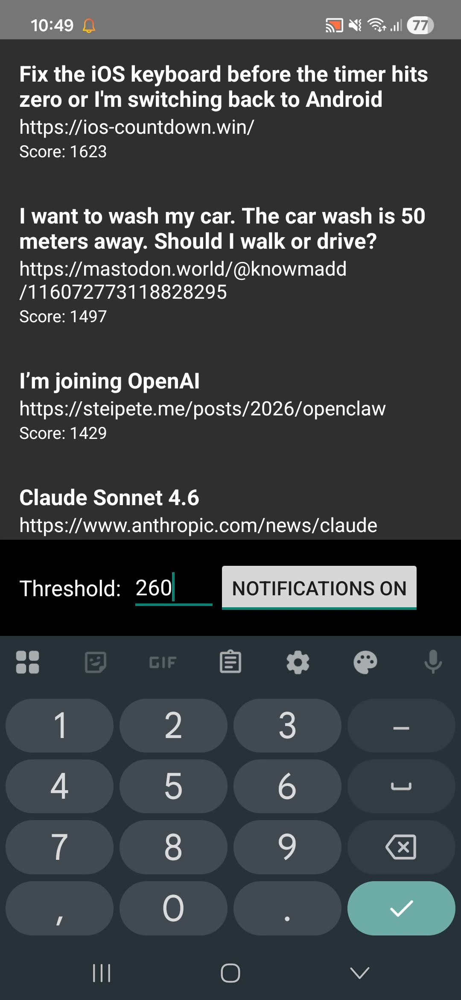

# 🕯️HN Monitor - High-Scoring Story Sentinel

> *A quiet watcher in the background: guarding attention by revealing only what truly rises above the noise of Hacker News.*

HN Monitor is an Android application that passively monitors Hacker News and surfaces only high-impact stories, allowing users to stay informed without repeatedly visiting the site or getting pulled into endless scrolling.

The app uses the [Official Hacker News API](https://github.com/HackerNews/API) to periodically fetch **Top** and **Best** stories, filters them by score (default: `250`), stores them locally, and displays them in a clean list UI. Optional push notifications can alert the user when new qualifying stories are found, even when the app is closed.

## Features

- Fetches **Top** and **Best** Hacker News stories
- User-configurable **score threshold**
- Background fetching using **WorkManager**
- Optional push **notifications**
- Local persistence of stories
- Stories sorted by score
- Simple, distraction-free UI with direct links to articles

## Demo

▶️ _Click on a thumbnail to watch the video on YouTube_

<table>
  <tr>
    <td align="center">
      <a href="https://www.youtube.com/shorts/6AWXTQHYtOw" target="_blank">
        
      </a>
      <br>
      <strong>Basic Usage</strong>
    </td>
    <td align="center">
      <a href="https://www.youtube.com/shorts/W5gF41gnusU" target="_blank">
        
      </a>
      <br>
      <strong>Adjusting the Threshold</strong>
    </td>
  </tr>
</table>


## How it works

- A background worker periodically queries the Hacker News API
- Stories above the configured threshold are fetched and stored locally
- Old stories are completely replaced with the fresh fetch to prevent accumulation
- If the threshold changes, stories below the new threshold are automatically removed
- If notifications are enabled, new stories trigger a system notification
- Opening the app displays the stored stories in a sorted list

## Usage

To try the application:

1. Clone the repository
2. Open the project in **Android Studio**
3. Build the project
4. Install the generated APK from:
    ```
    app/build/outputs/apk/debug
    ```

## Screenshots

<table>
  <tr>
    <td align="center">
      
      <br>
      List of Stories
    </td>
    <td align="center">
      
      <br>
      Receiving Notifications
    </td>
    <td align="center">
      
      <br>
      Opening a Story
    </td>
    <td align="center">
      
      <br>
      Adjusting the Threshold
    </td>
  </tr>
</table>


## Roadmap / Ideas

Future improvements are mainly focused on **UX and polish**, for example:

- Logo/name update
- Better visual hierarchy for story rows
- Improved sorting and filtering options
- Smoother UI updates
- Dark mode and accessibility improvements

## License

This project is licensed under the MIT License. See the [LICENSE](LICENSE) file for details.
